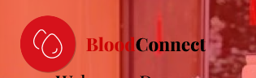

# Tugas-Besar-Desain-Interaksi-Kelompok-9

# BloodConnect ITERA 🩸

<<<<<<< HEAD

=======

>>>>>>> e602b50ee34bd84f1acbd63ac3f167ff20746eb2

 

---

## 📋 Tentang Proyek

**BloodConnect ITERA** adalah aplikasi mobile yang dirancang khusus untuk mempermudah urusan donor darah di Institut Teknologi Sumatera (ITERA). Aplikasi ini hadir sebagai solusi digital untuk menghubungkan pendonor, pencari darah, dan penyelenggara event donor darah di lingkungan kampus.

### 🎯 Tujuan Aplikasi

- Memudahkan pencarian pendonor darah dengan golongan darah tertentu secara cepat
- Mendigitalisasi proses pendaftaran event donor darah kampus
- Menyediakan media terpusat untuk menghubungkan pendonor dan penerima darah
- Meningkatkan kesadaran dan edukasi mahasiswa tentang donor darah

---

## Latar Belakang Masalah

Berdasarkan observasi dan diskusi dengan mahasiswa ITERA, ditemukan beberapa permasalahan utama:

1. **Kesulitan Pencarian Cepat** - Sulit menemukan pendonor darah dengan golongan darah tertentu, terutama dalam kondisi darurat
2. **Kurangnya Platform Terpusat** - Belum ada media digital yang menghubungkan pendonor dan penerima darah secara langsung
3. **Proses Manual** - Kegiatan donor darah kampus belum terdigitalisasi, pendaftaran masih manual
4. **Minimnya Edukasi** - Kurangnya kesadaran mahasiswa tentang manfaat donor darah dan prosedur kesehatannya

---

## ✨ Fitur

### 🔍 1. Pencarian Pendonor Darurat

Memungkinkan pencarian cepat dan terverifikasi untuk menemukan pendonor sukarela di lingkungan kampus berdasarkan golongan darah dan rhesus. Fitur ini dirancang khusus untuk situasi darurat yang kritis.

**Fitur Detail:**

- Filter berdasarkan golongan darah (A, B, AB, O)
- Filter berdasarkan rhesus (+/-)
- Informasi kontak pendonor yang tersedia
- Status ketersediaan pendonor real-time
- Notifikasi push untuk permintaan darurat

### 📝 2. Pendaftaran Event Online

Mendigitalisasi proses pendaftaran event donor darah. Mahasiswa bisa mendaftar secara online, dan panitia (UKM) mendapatkan dashboard otomatis untuk mengelola pendaftar.

**Fitur Detail:**

- Formulir pendaftaran online yang mudah
- Jadwal event donor darah kampus
- Reminder otomatis sebelum event
- QR Code untuk check-in peserta
- Riwayat partisipasi donor darah

### 📚 3. Pusat Edukasi & Informasi

Menyediakan konten tepercaya (artikel, infografis, dan FAQ) untuk mematahkan mitos dan menjawab keraguan. Fitur ini bertujuan untuk meningkatkan kesadaran dan kenyamanan calon pendonor pemula.

**Fitur Detail:**

- Artikel tentang manfaat donor darah
- Infografis prosedur donor darah
- FAQ (Frequently Asked Questions)
- Video edukatif tentang proses donor
- Tips kesehatan sebelum dan sesudah donor

### 📊 4. Dashboard Penyelenggara

Dashboard khusus untuk panitia/UKM yang menyelenggarakan event donor darah di kampus.

**Fitur Detail:**

- Manajemen pendaftar event
- Statistik dan laporan donor darah
- Broadcast notifikasi ke peserta
- Validasi dan verifikasi peserta
- Export data pendaftar

### 👤 5. Profil Pendonor

**Fitur Detail:**

- Informasi pribadi dan golongan darah
- Riwayat donor darah
- Achievement badges
- Sertifikat digital donor darah
- Pengaturan notifikasi dan privasi

## 👨‍💻 Tim Pengembang

<table>
  <tr>
    <td align="center">
      <b>Agus Subekti</b> 
      123140104 
      <a href="https://github.com/agussubekti">GitHub</a>
    </td>
    <td align="center">
      <b>Ebentua Philippus Limbong</b> 
      123140086 
      <a href="https://github.com/ebenlimbong">GitHub</a>
    </td>
    <td align="center">
      <b>Ahmat Prayoga Sembiring</b> 
      123140053 
      <a href="https://github.com/Ahmatsembiring">GitHub</a>
    </td>
  </tr>
  <tr>
    <td align="center">
      <b>Rifael Eurico Sitorus</b> 
      123140077 
      <a href="https://github.com/eltoruz">GitHub</a>
    </td>
    <td align="center">
      <b>Aryasatya Widyatna Akbar</b> 
      123140164 
      <a href="https://github.com/aryasatya">GitHub</a>
    </td>
    <td align="center">
    </td>
  </tr>
</table>

### 📚 Pembimbing

- **Dosen Pengampu:** Amirul Iqbal, S.Kom., M.Eng.
- **Asisten Praktikum:** Fauzi Azizi (122140106)

---

## 🏫 Institusi

**Program Studi Teknik Informatika**
Fakultas Teknologi Industri
Institut Teknologi Sumatera
November 2025

---

## 📸 Demo

### Screenshots

_Coming Soon - Screenshots aplikasi akan ditambahkan_

### Wireframes

_Coming Soon - Wireframes akan ditambahkan_

### Prototype

Akses prototype interaktif: [Link Figma/Adobe XD]

### User Flow

_Coming Soon - Diagram user flow akan ditambahkan_

---

## 🛠️ Tech Stack

### Design & Prototyping

- **Figma** - UI/UX Design & Prototyping
- **Adobe Illustrator** - Icon & Asset Design

**Dibuat dengan ❤️ oleh Tim Kelompok 9**

**Program Studi Teknik Informatika - Institut Teknologi Sumatera**

⭐ Jangan lupa berikan bintang jika proyek ini bermanfaat!

---

_"Setetes darah Anda, sejuta harapan bagi mereka"_

